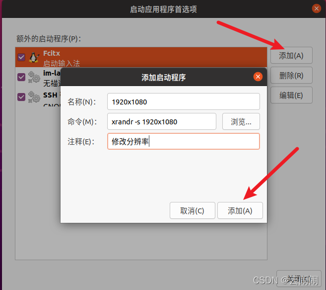

## 添加分辨率
如果说xrandr查看发现并没有我们需要的1920x1080，或者说我们想修改成自己喜欢的分辨率，可以按照下面的方法：

1.以1600x900为例，查看可以发现系统并没有这个分辨率，需要我们手动添加

2.输入cvt+你需要的分辨率
将控制台输出的数据记录下来

3.方便起见，我们直接在/etc/profile文件末尾进行添加，这样可以在保证在系统重启后不会丢失
>vim /etc/profile

在文件最后添加下面信息：
~~~
cvt 1600 900
xrandr --newmode "1600x900_60.00"  118.25  1600 1696 1856 2112  900 903 908 934 -hsync +vsync
xrandr --addmode Virtual1 "1600x900_60.00"
~~~

其中--newmode后面跟红框中的数据，--addmode后面跟刚刚记下的设备名称
然后保存退出

## 设置启动项

打开应用台，点击“启动应用程序”

即可在开机自启